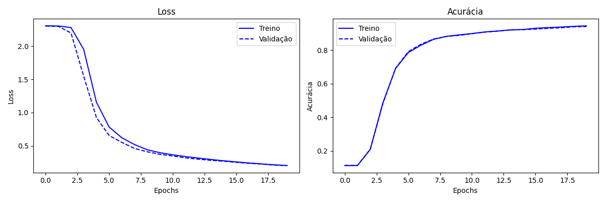
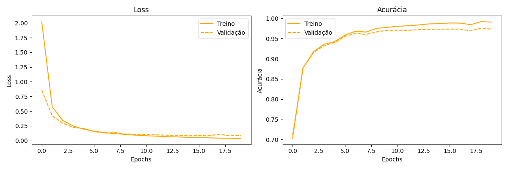

# MLP do Zero

Implementação de um Multi-Layer Perceptron (MLP) do zero usando apenas NumPy, treinado no dataset MNIST para classificação de dígitos manuscritos.

## Estrutura do repositório

```
.
├── README.md
├── mlp/
│   ├── __init__.py
│   ├── network.py         ← implementação do MLP (forward, backward, fit)
│   ├── activations.py     ← ReLU e Softmax
│   ├── losses.py          ← Cross Entropy e One-Hot Encoding
│   └── optimizers.py      ← SGD
├── notebook/
│   └── experimentos.ipynb ← experimentos e análises
├── results/
│   ├── loss_accuracy.png
│   └── comparacao.png
└── requirements.txt
```

---

## Como rodar

**1. Instalar dependências:**

```bash
pip install -r requirements.txt
```

**2. Executar o notebook:**

Abra `notebook/experimentos.ipynb` no Jupyter e execute as células em ordem.

---

## Arquitetura escolhida

```
Entrada        784 neurônios  (28×28 pixels achatados)
Camada oculta 1  128 neurônios  + ReLU
Camada oculta 2   64 neurônios  + ReLU
Saída             10 neurônios  + Softmax
```

| Componente        | Escolha              |
|-------------------|----------------------|
| Ativação ocultas  | ReLU                 |
| Ativação saída    | Softmax              |
| Loss              | Cross Entropy        |
| Otimizador        | SGD                  |
| Learning rate     | 0.1                  |
| Batch size        | 64                   |
| Epochs            | 10                   |

**Por que essa arquitetura:**
- 2 camadas ocultas permitem aprender representações mais abstratas dos dígitos
- ReLU evita o problema do gradiente desaparecendo e é computacionalmente eficiente
- 128 → 64 neurônios reduz progressivamente a dimensionalidade até os 10 classes de saída

---

## Resultados

### Comparação de configurações

| Configuração | Loss (epoch 10) | Acurácia (epoch 10) |
|--------------|-----------------|----------------------|
| lr = 0.01    | 0.4378          | 88.32%                 |
| lr = 0.1     | 0.0442           | 97.44%               |

#### Primeira configuração (lr=0.01)



#### Segunda configuração (lr=0.1)



---

## Decisões e dificuldades

<!-- Escreva em primeira pessoa. Responda:
1. Qual foi a decisão técnica mais difícil que você tomou? Por que fez essa escolha?
2. O que você tentou que não funcionou? O que aprendeu com isso?
3. Se fosse refazer do zero, o que faria diferente?
-->
